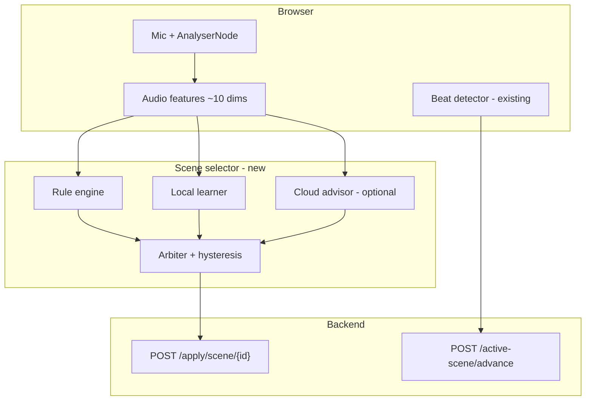

# AI scene selection — recommended approach

## What you are solving

Your app already has the right primitives:

- **Scenes** = named, ordered `preset_ids` ([`backend/models/scene.py`](backend/models/scene.py))
- **Activation** = `POST /api/apply/scene/{scene_id}` ([`backend/routes/post.py`](backend/routes/post.py))
- **Within-scene preset cycling** = beat detection in [`frontend/js/home.js`](frontend/js/home.js) → `POST /api/active-scene/advance` (unchanged; AI does not need to replace this for “scenes only”)

The deleted [`backend/ai_mode`](backend/ai_mode) stack used **SAC reinforcement learning** over a **continuous** action space (every DMX channel + LedFx index). That is the wrong abstraction for “pick one of my curated Scenes” and is heavy (PyTorch/SB3, Windows DLL issues, large action space, bypasses presets).

## Best AI type (by layer)

| Layer | AI type | Why it fits |
|-------|---------|-------------|
| **1 — Ship first** | **Rule-based / heuristic policy** on audio features | Discrete scenes, interpretable, zero training, works offline, &lt;10 ms. Map energy, bass, tempo proxy, spectral centroid → scene tags you define. |
| **2 — Improve over shows** | **Contextual bandit** or **online classifier** (not full RL) | Same 10-dim (or slightly enriched) features → `scene_id`. User feedback updates weights. Action space = `N scenes` (small), not `N×255 DMX`. Use **scikit-learn** `SGDClassifier` / softmax regression, or a simple **LinUCB / Thompson sampling** bandit—no Stable-Baselines3 required. |
| **3 — Optional mood** | **Cloud LLM / classifier API** (low frequency) | Good for ambiguous tracks (“is this bridge or chorus?”). Call every 5–15 s or on large energy shifts; returns ranked `scene_id` + reason. Never on every FFT frame. |
| **Avoid as primary** | SAC / continuous RL ([old `LightsControlEnv`](backend/ai_mode/env.py)) | Wrong output type, unstable live, hard to debug, conflicts with preset/scene model. |
| **Avoid as primary** | LLM every prediction tick | Latency, cost, jitter; unsuitable for real-time lighting. |

**Recommendation:** Treat this as **audio-conditioned multi-class scene selection** with a **policy stack**, not end-to-end RL over hardware.

## Audio input (keep in browser)

You already compute suitable features in [`frontend/js/ai_mode.js`](frontend/js/ai_mode.js) (5 bands, beat features, centroid, energy) and simpler beat flux in [`frontend/js/home.js`](frontend/js/home.js).

- **Consolidate** one shared `audio_features.js` used by Home, Active, and AI scene mode (remove duplication).
- **Enrich lightly** for scene choice (still cheap): short rolling means (3–5 s) of energy/bass, estimated BPM from beat intervals, “section change” flag from flux spikes (reuse beat logic).
- Send a compact JSON payload to the backend on a **throttled** interval (e.g. 4–10 Hz), not every animation frame.

Server-side [`audio_features.py`](backend/ai_mode/audio_features.py) is optional (parity/tests only); live path stays client-side like today.

## Scene selection logic

### Layer 1 — Rules (default)

- Add **metadata per scene** (stored in `scenes.json` or a sidecar), e.g. `tags: ["high_energy", "bass_heavy"]` or numeric targets `{ energy: [0.6, 1.0], bass: [0.5, 1.0] }`.
- Score each scene against current (and smoothed) features; pick argmax if margin &gt; threshold.
- **Hysteresis:** require new scene to win for ~2–5 s (or M consecutive ticks) before calling `apply/scene`—prevents flicker.
- **Cooldown:** minimum time between scene switches (e.g. 8–15 s) except manual override.

### Layer 2 — Local learning from feedback

- **Problem formulation:** contextual bandit or supervised classifier  
  - Context `x` = audio feature vector (+ optional time-in-show)  
  - Action `a` = `scene_id`  
  - Reward from UI: rating 1–10, thumbs, or “wrong scene” (−1).
- **Implementation sketch:** `sklearn.linear_model.SGDClassifier` with `partial_fit`, or store per-scene reward counts and use **epsilon-greedy** / Thompson sampling over rule scores.
- Persist `data/ai_scene_model.json` (weights + scene list hash)—much smaller than `ai_mode_model.pkl`.
- **Do not** restore SAC unless you later expand scope to full DMX control.

### Layer 3 — Cloud advisor (optional, config-gated)

- When local confidence is low (top two scenes within ε), optionally call cloud with: feature summary, scene names/tags, current scene, last switch time.
- Structured response: `{ "scene_id": "...", "confidence": 0.8, "reason": "..." }`.
- Merge as a **bias** in the arbiter, not a hard override unless confidence is high.
- Requires API key in [`config.json`](backend/models/config.py); clearly offline fallback to rules+local.

## Backend API (new, scene-focused)

Replace or supersede broken imports in [`backend/routes/ai_mode.py`](backend/routes/ai_mode.py) with a slimmer module, e.g. `backend/scene_ai/`:

| Endpoint | Purpose |
|----------|---------|
| `POST /api/scene-ai/start` | Enable selector, load model |
| `POST /api/scene-ai/stop` | Disable |
| `POST /api/scene-ai/tick` | Body: audio features → returns `{ scene_id, confidence, source: "rules"\|"local"\|"cloud" }`; server may call `set_scene` + `apply` internally or return id for client to apply |
| `POST /api/scene-ai/feedback` | Rating / wrong-scene for learning |
| `GET /api/scene-ai/status` | Active, last scene, feedback count |

Wire in [`backend/main.py`](backend/main.py) with the same try/except pattern as today (graceful degrade if sklearn missing).

**Activation:** On accepted scene change → existing [`post_apply_scene`](backend/routes/post.py) path so DMX, LedFx via presets, and `active_scene` state stay consistent.

## Frontend UX

- New page or section on **Active**: “AI scene mode” toggle, mic (reuse), current scene + confidence + source, manual scene override, feedback controls (reuse patterns from [`frontend/html/ai_mode.html`](frontend/html/ai_mode.html)).
- When AI scene mode is on: **AI** calls `apply/scene`; **beat** still calls `advance` for preset cycling inside the chosen scene.
- Link from [`frontend/index.html`](frontend/index.html) nav (AI page exists but is orphaned).

## What to do with deleted `backend/ai_mode`

| Option | Verdict |
|--------|---------|
| Restore SAC package as-is | **No** for your stated goal (scenes only) |
| Salvage `audio_features.py`, feedback reward helpers, state/undo patterns | **Yes** — adapt for scene-level actions |
| Keep `requirements.txt` SB3/torch block commented | **Yes** until/unless you add full DMX AI later |

## Dependencies

- **Phase 1:** none beyond existing stack.
- **Phase 2:** `scikit-learn` (+ `numpy`) — lighter than `stable-baselines3` + torch.
- **Phase 3:** `httpx` + provider SDK for cloud; optional.

## Phased delivery

1. **Scene tags + rule engine + hysteresis** → working AI scene picker offline.  
2. **Shared audio module + `/scene-ai/tick` API** → clean integration with Active page.  
3. **Feedback + online local model** → learns your taste per venue/genre.  
4. **Optional cloud advisor** → config flag, rate-limited.  
5. (Later, only if scope grows) preset-level or DMX-level control — that’s when RL or generative policies might be reconsidered.

## Success criteria

- AI selects only from existing scenes in `scenes.json`.  
- Scene switches are stable (no rapid flicker).  
- Works fully offline with rules; improves with local feedback; cloud is optional enhancement.  
- Beat-sync preset advance within a scene continues to work without retraining the old SAC model.
